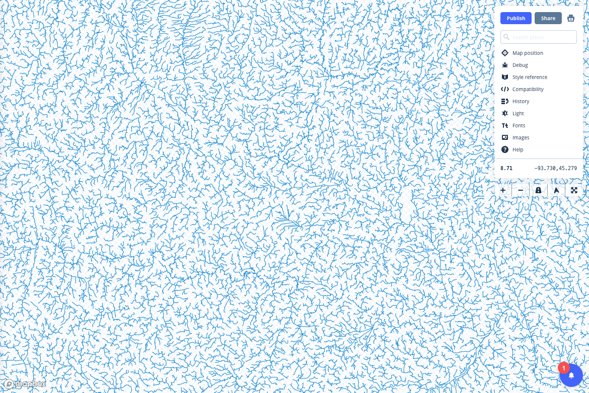
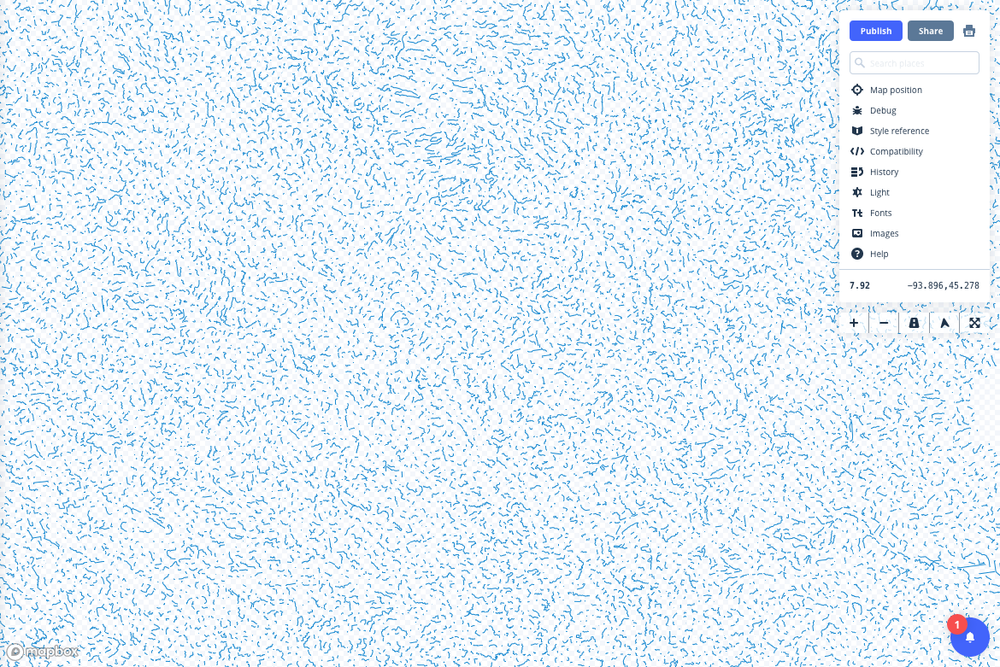
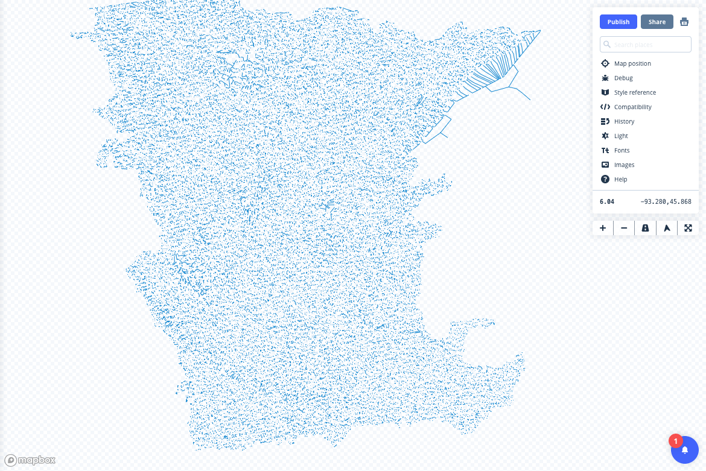
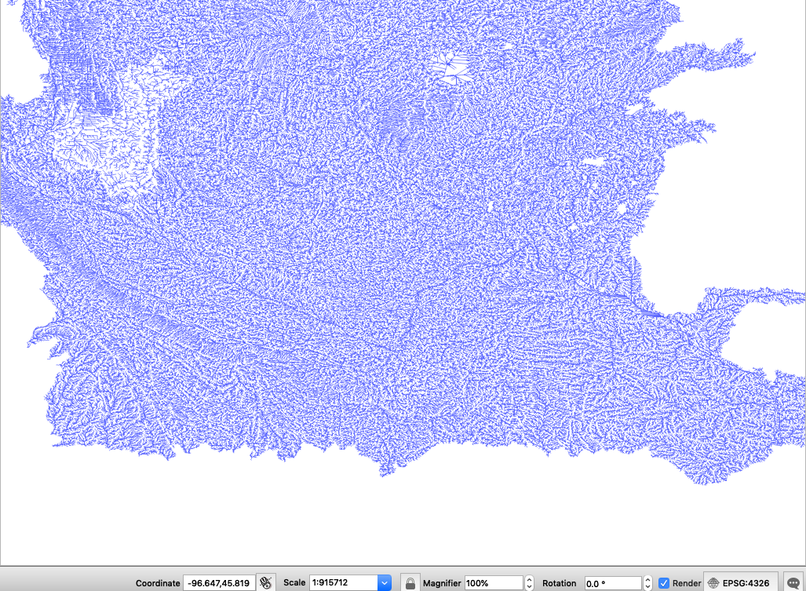

## 1/7/2019  
- Created makefile that downloads state osm datasets from geofabrik
- Moved create-react-app into `web` directory

**Next Steps**
- Add Makefile steps to:
  - Import .pbf into PostGIS (use Docker container)
  - Process OSM tables, export back to files (geojson)
  - Clip to area of interest  

## 1/8/2019
- Found that OGR2OGR can be used to extract .pbf files.  Use this instead of getting a PostGIS database & Docker involved (unless found necessary)  
- Add Make steps to download natural earth "populated places" dataset to be used for labeling.  

**Next Steps**
- Determine which OSM layers will be helpful for the map.  
- Write makefile steps to extract those layers into geojson using OGR2OGR
- Get polygons for just MN and WI (Natural Earth with some processing)
- Determine which other layers will be used in the map (lakes, physical, other?)
- Write steps to download those data sources and clip them to the area of interest
- Determine the area of interest for the map (maybe less than all of MN and WI?)


## 1/12/2019
- Explored DNR water data
- Found AWESOME hydrology flow dataset
- Tried to convert to geojson or topojson... hit dbf error from shapefile
- Mapshaper, OGR2OGR couldn't handle the conversion
- Uploaded to Mapshaper GUI, exported as zipped shapefile
- Uploaded zipped shapefile to Mapbox Studio as tileset
- Successfully converted :-)  but the default zooms through simplification are no good (8-14)

**Next Steps**
- Decide what Sunday's #CreativeCarto will be
- Update Makefile for newly found datasets, which might not be part of this project but a separate Minnesota Water, "Land of 10,000 Lakes".  Could incorporate environmental issues in the state & be cool.
- Try Tippecanoe for custom shape => vector tile conversion (to get the zoom)
- Continue to explore options for visualizing
 - Deckgl, Keplergl, Mapboxgl, Tangram (probs not), D3 Canvas (probs not)
 - Possible to animate the network?

 ## 1/14/2019
 - Hydro flow => Tippecanoe
    - See Eric Fisher's [map of of 10 million tweets process](https://blog.mapbox.com/making-the-most-detailed-tweet-map-ever-b54da237c5ac)
    - Check out [Tippecanoe docs](https://github.com/mapbox/tippecanoe) for guidance
    - Need to fix the gdal error.  [Found that it comes from a shapefile error](https://github.com/OSGeo/gdal/issues/937) (cannot be larger than 2gb).  
      - Attempt to first load into PostGIS, then export from PostGIS
      - `shp2pgsql ${SHAPEFILE}`
      - Check [shp2pgsql](http://www.bostongis.com/pgsql2shp_shp2pgsql_quickguide_20.bqg) docs
      - 
      ```shell
      # create insert statement, pipe into mn database
      shp2pgsql -s 26915 $(SHAPEFILE) public.flow | psql -d mn
      ```
      - Export with ogr2ogr `ogr2ogr -f GeoJSON flow.geojson PG:"dbname=mn" flow`
    - Download flow lines [without all the parent directories](https://superuser.com/questions/389168/wget-download-all-files-but-not-preceding-folders)
        - `wget -np -nH --cut-dirs 5 -r ftp://ftp.dnr.state.mn.us/pub/waters/watershed_data/flow_networks/Statewide/`
    - Updated Makefile with the steps to get `data/flow.geojson`.  *Need to figure out why make is running all the steps when the files already exist*
    - Fix projection errors by specifying utm 15 when importing into postgis (and transform to 4326)
    - Try default tippecanoe vector tile generation
      - `tippecanoe -o flow.mbtiles -zg --drop-densest-as-needed flow.geojson`
      - Upload to Mapbox to view the resulting tileset:
        - Zoom 8.7 Looks Fine
        - 
        - Zoom 7.92 Too simplified
        - 
        - Zoom 6.04 Much too simplified
        - 
        - Versus the geomorphology that we can discern when viewing the raw dataset in QGIS:
        - 
- Clean up unstaged commits, push work up to Github.

**Next Steps**
- Play around with tippecanoe to find the right balance between storage efficiency and visual output.